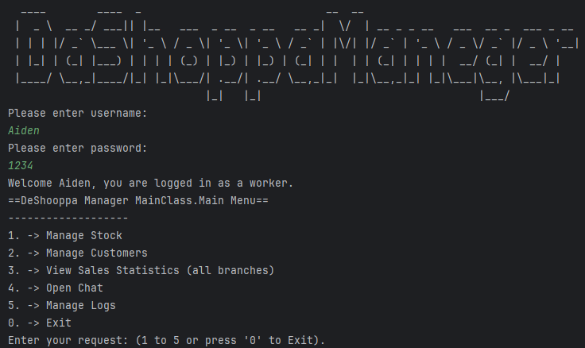

<h1>DaShoppaManager</h1>

<h2>Clothing Store Chain Management System</h2>

A comprehensive Java-based application for managing clothing store chain operations, including worker and customer management, stock management, sales analytics, and logging. The system enforces role-based authorization using different permission levels (admin, shift manager, worker).

<h2>Features</h2>

<ul>
  <li><strong>Login System</strong>: Authenticates workers, admins, and shift managers, providing role-based access to different functionalities.</li>
  <li><strong>Manage Workers</strong>: Admins can view all workers and register new accounts.</li>
  <li><strong>Manage Stock</strong>: View stock for all branches or specific branches. Process purchases on behalf of customers.</li>
  <li><strong>Manage Customers</strong>: View all customers' details.</li>
  <li><strong>Sales Analytics</strong>: View sales by branch, product, or category.</li>
  <li><strong>Logging</strong>: View system logs by date for auditing purposes.</li>
  <li><strong>Chat</strong>: Features a rich chat functionality to open communication channels between workers.</li>
</ul>

<h2>Requirements</h2>

<ul>
  <li>Java 8 or higher</li>
  <li>JSON-simple library (already included in the project dependencies)</li>
</ul>

<h2>Installation</h2>

<ol>
  <li>Clone the repository:</li>

<pre><code>
git clone https://github.com/DanielDolberg/DaShoppaManeger.git
cd DaShoppaManeger
</code></pre>

  <li>Open the project in your preferred IDE (e.g., IntelliJ, Eclipse).</li>

  <li>Compile and run the MainServer.java at:</li>

<pre><code>
..\DaShoppaManeger\src\ServerStuff
</code></pre>

  <li>Compile and run the Main.java at:</li>

<pre><code>
..\DaShoppaManeger\src\MainClass
</code></pre>

  For each worker instance you desire.

</ol>

<h2>Usage</h2>

When run, the main application will prompt for a username and password. It only authenticates users that are in ‘workers.json’. Once you successfully log in you will see the main menu like so:

<h2>Enjoy!</h2>
